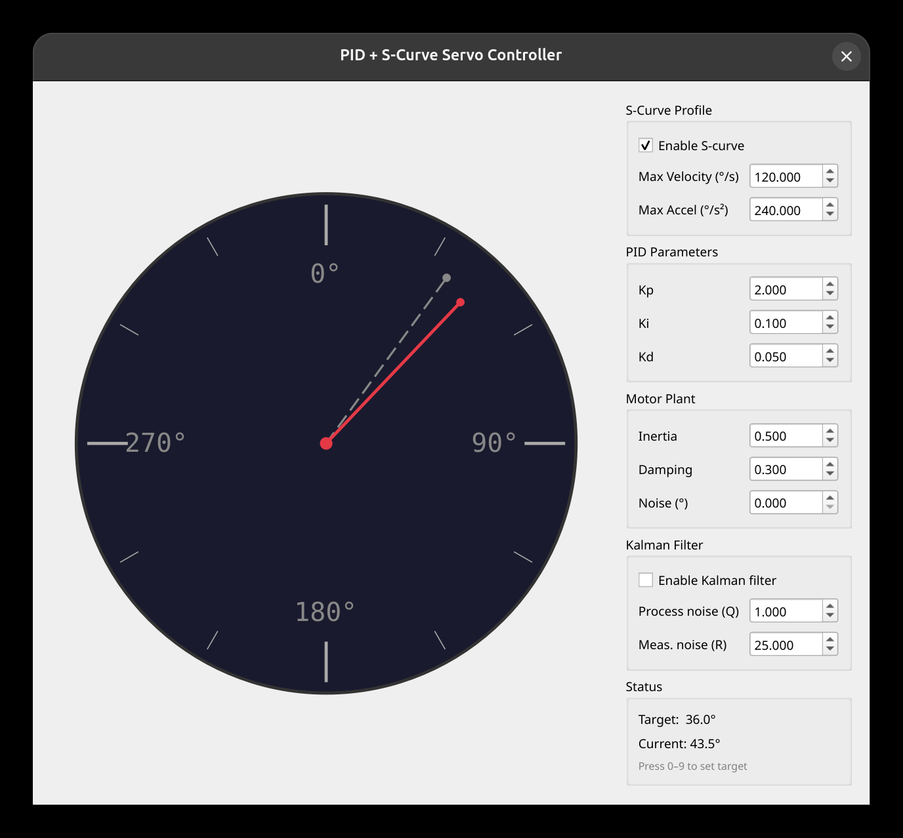

# PID Servo Controller Simulator

An interactive desktop simulator for a PID-controlled servo motor, built with Python and PySide6. Visualises the closed-loop control system in real time on an analogue clock face, and lets you tune every parameter live.



## Features

- **PID controller** with live-adjustable Kp / Ki / Kd gains, integral anti-windup, and sign-change integral reset
- **Trapezoidal (S-curve) motion profile** — smooth acceleration and deceleration to a target angle, with triangular-profile fallback for short moves
- **Second-order motor plant simulation** — models inertia, viscous damping, and torque input via forward-Euler integration
- **Motor-model-aware Kalman filter** — 2-state (position + velocity) filter that uses the plant equations in the prediction step for accurate noise rejection
- **Configurable sensor noise** — Gaussian noise injected into position measurements
- **Clock face display** — solid red needle = motor position, dashed grey needle = target; updates at 50 Hz
- **Keyboard shortcuts** — press `0`–`9` to jump to 0°, 36°, 72° … 324°

## Architecture

```
main.py                 Entry point — creates the QApplication and MainWindow
main_window.py          Main GUI window; drives the 50 Hz simulation loop
├── pid.py              PIDController   — error → torque output
├── scurve.py           SCurveProfile   — generates desired position trajectory
├── motor.py            MotorSim        — integrates torque → velocity → position
├── kalman.py           KalmanFilter    — filters noisy position measurements
└── clock_widget.py     ClockWidget     — QPainter clock-face visualisation
```

## Requirements

- Python 3.9+
- [PySide6](https://pypi.org/project/PySide6/)

## Installation

```bash
git clone https://github.com/srand/pid-servo-sim.git
cd pid-servo-sim
pip install -r requirements.txt
```

## Usage

```bash
python main.py
```

Use the panel on the right to tune parameters while the simulation runs.

| Control | Description |
|---|---|
| **S-Curve Profile** | Toggle the motion profile on/off; set max velocity (°/s) and max acceleration (°/s²) |
| **PID Parameters** | Adjust Kp, Ki, Kd in real time |
| **Motor Plant** | Change inertia, damping coefficient, and sensor noise standard deviation |
| **Kalman Filter** | Enable/disable; tune process noise Q and measurement noise R |
| **Keys 0–9** | Set target to `n × 36°` (e.g. `5` → 180°) |

## Module Reference

### `PIDController` (`pid.py`)

Standard PID with:
- Output clamping (`output_min` / `output_max`)
- Integral clamping (`integral_max`) to prevent windup
- Integral reset when the error crosses zero

```python
pid = PIDController(kp=2.0, ki=0.1, kd=0.05)
torque = pid.update(setpoint, measured, dt)
```

### `SCurveProfile` (`scurve.py`)

Trapezoidal velocity profile generator. Computes acceleration, cruise, and deceleration phase durations from `max_vel` and `max_acc`, falling back to a triangular profile when the move is too short to reach `max_vel`.

```python
profile = SCurveProfile(max_vel=120.0, max_acc=240.0)
profile.set_target(current_pos, current_vel, target_pos)
desired = profile.update(dt)   # call each simulation step
```

### `MotorSim` (`motor.py`)

Second-order plant: `accel = (torque − damping × vel) / inertia`

```python
motor = MotorSim(inertia=0.5, damping=0.3)
motor.apply(torque, dt)
print(motor.position, motor.velocity)
```

### `KalmanFilter` (`kalman.py`)

2-state Kalman filter (position + velocity) with a motor-model prediction step. Tune `q` (process noise) vs `r` (measurement noise variance, ≈ noise_std²).

```python
kf = KalmanFilter(q=1.0, r=25.0, inertia=0.5, damping=0.3)
filtered_pos = kf.update(measurement, dt, torque)
```

### `ClockWidget` (`clock_widget.py`)

A `QWidget` that renders the clock face with QPainter. Call `set_angles(current, target)` to update.

## License

MIT
